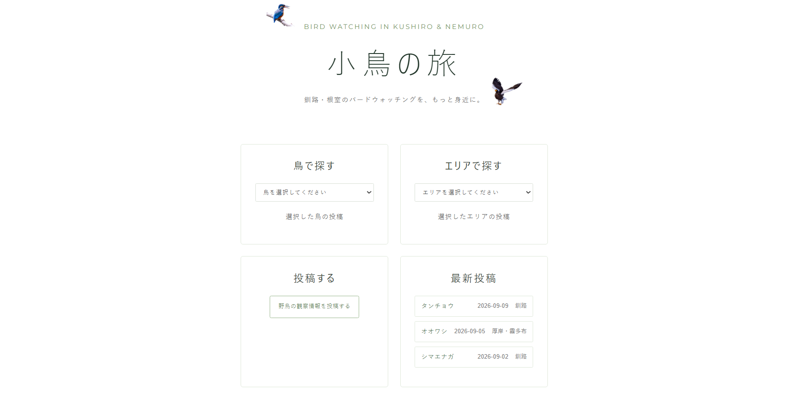
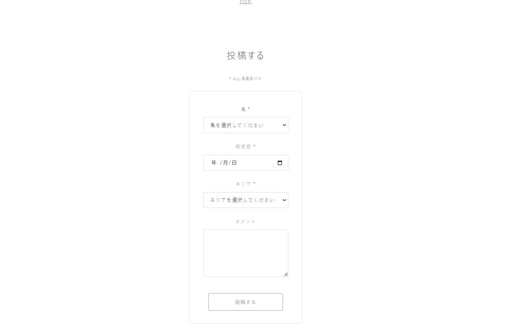
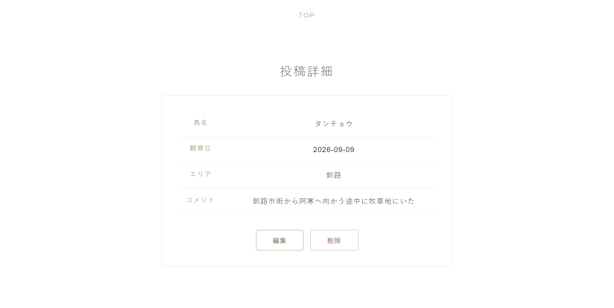
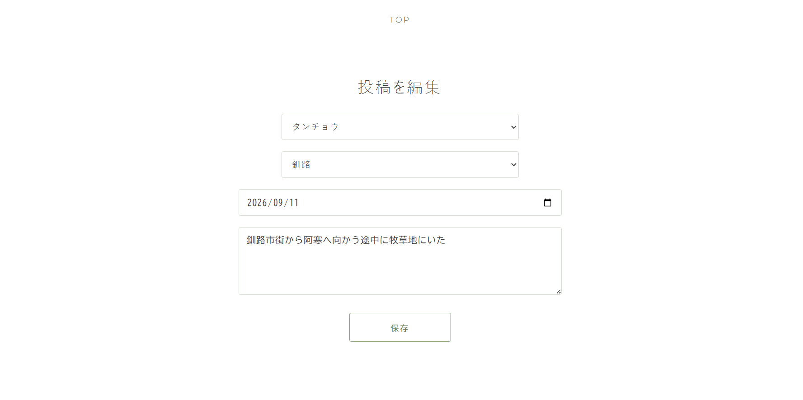

# 小鳥の旅

### BIRD WATCHING IN KUSHIRO & NEMURO

釧路・根室の野鳥観察を、もっと身近に。

---

## 概要

「小鳥の旅」は、釧路・根室地域で観察された野鳥情報を共有するWebアプリケーションです。

鳥の種類やエリアから観察情報を探したり、自分が観察した野鳥情報を投稿したりできます。

観察地点は詳細な位置情報ではなくエリア単位で共有することで、
野鳥観察に必要な情報を提供しつつ、私有地への立ち入りや野鳥への過度な接近などを防ぐことも意識しています。

---

## 開発背景

釧路・根室地域は、タンチョウやオオワシなど多様な野鳥を観察でき、
国内外のバードウォッチャーにとって魅力の大きい地域です。

こうした豊かな自然資源を、地域内の周遊や宿泊・飲食・交通などの
観光消費へさらに結びつけることができるのではないかと考えました。

旅行者が
「どの鳥が、どのエリアで、最近観察されたのか」
を簡単に確認できる仕組みを作り、バードウォッチングをより身近なものとし、
将来的には、各エリアの観光・飲食・アクセス情報なども組み合わせることで、
バードウォッチングをきっかけとした釧路・根室での滞在をより楽しめることを目指して、
このアプリを企画しました。

また、直近の観察情報を継続的に提供するためには、
地域住民や地元のバードウォッチャーによる観察情報の投稿が重要です。

一方で、野鳥観察情報の公開には、
私有地・農地への立ち入りや野鳥への過度な接近、
地域住民や自然環境への負荷といった問題も考えられます。

そのため、詳細な観察地点は公開せず、
大まかなエリア単位で情報を共有する設計としています。

今回はMVPとして、
野鳥の観察情報を投稿・検索・閲覧できるコア機能の実装に絞っています。

---

## 主な機能

- 鳥から観察投稿を検索
- エリアから観察投稿を検索
- 観察日の新しい順で最新情報を表示
- 野鳥観察情報の投稿
- 投稿詳細の表示
- 投稿編集
- 投稿削除

投稿完了後は、作成した投稿の詳細画面へ遷移します。

---

## 画面

### トップ画面



### 投稿画面



### 投稿詳細画面



### 投稿編集画面



---

## 使用技術

### Frontend

- React
- JavaScript
- HTML
- CSS
- React Router
- Vite

### Backend

- Java
- Spring Boot
- Spring Data JPA
- Maven

### Database

- MySQL 8.4
- Docker

### Development Environment

- IntelliJ IDEA
- Git
- GitHub

---

## システム構成

```text
React
  ↓ HTTP / JSON
Spring Boot
  ↓
Service
  ↓
Repository
  ↓
MySQL（Docker）

---

## ER図

```mermaid
erDiagram
    BIRD ||--o{ POSTS : has
    AREA ||--o{ POSTS : has

    BIRD {
        bigint id PK
        varchar name_ja
        varchar name_en
        varchar description
        varchar image_url
    }

    AREA {
        bigint id PK
        varchar name
    }

    POSTS {
        bigint post_id PK
        bigint bird_id FK
        bigint area_id FK
        date observed_date
        varchar comment
        datetime created_at
    }

※ `created_at` は現在のMVPでは未使用です。

---

## API一覧

| Method | Endpoint                 | 内容          |
| ------ | ------------------------ | ----------- |
| GET    | `/api/posts`             | 投稿一覧取得      |
| GET    | `/api/posts?birdId={id}` | 鳥IDで投稿を検索   |
| GET    | `/api/posts?areaId={id}` | エリアIDで投稿を検索 |
| GET    | `/api/posts/{postId}`    | 投稿詳細取得      |
| POST   | `/api/posts`             | 投稿作成        |
| PUT    | `/api/posts/{postId}`    | 投稿更新        |
| DELETE | `/api/posts/{postId}`    | 投稿削除        |

---

## ローカル環境での起動方法

前提環境

以下がインストールされていることを前提としています。

Java
Node.js / npm
Docker
Git

1. リポジトリをクローン

git clone <GitHubリポジトリURL>
cd birdwatching-app

2. MySQLコンテナを作成

docker run --name birdwatching-mysql `
  -e MYSQL_ROOT_PASSWORD=<任意のrootパスワード> `
  -e MYSQL_DATABASE=birdwatching `
  -e MYSQL_USER=birduser `
  -e MYSQL_PASSWORD=<任意のユーザーパスワード> `
  -p 3306:3306 `
  -d mysql:8.4

application.properties のデータベースユーザー名・パスワードは、
上記で設定した値と一致させてください。

例：

spring.datasource.url=jdbc:mysql://localhost:3306/birdwatching
spring.datasource.username=birduser
spring.datasource.password=<設定したユーザーパスワード>
spring.jpa.hibernate.ddl-auto=update

3. Backendを起動

cd backend
.\mvnw.cmd spring-boot:run

Backend：

http://localhost:8080

初回起動時にSpring Data JPAによって必要なテーブルが作成されます。

4. 初期データを登録

プロジェクト直下へ戻ります。

```powershell
cd ..

backend/init-data.sql をMySQLコンテナへコピーします。

docker cp .\backend\init-data.sql birdwatching-mysql:/tmp/init-data.sql

続いて、初期データをMySQLへ登録します。

docker exec birdwatching-mysql sh -c "mysql --default-character-set=utf8mb4 -u root -p birdwatching < /tmp/init-data.sql"

パスワード入力を求められたら、MySQLコンテナ作成時に設定したrootパスワードを入力してください。

初期データには、鳥・エリア・観察投稿が含まれています。

5. Frontendを起動

別のPowerShellを開き、プロジェクト直下から以下を実行します。

cd frontend
npm install
npm run dev

Frontend：

http://localhost:5173

---

## 設計からの主な変更点

実装・動作確認の過程で、操作性と構成の簡潔さを考慮し、一部仕様を変更しています。

トップ画面のURLを /top から / に変更
投稿編集は専用画面ではなく、投稿詳細画面内で行う構成に変更
MVPでは画像投稿機能を実装対象外とした
最終的なER図は、実装時のテーブル・カラム構成に合わせて更新

---

## 今後追加したい機能
エリアごとの観光情報
飲食店情報
各エリアへのアクセス情報
英語対応
ユーザー登録・ログイン
お気に入りの鳥登録
観察情報の通知
野鳥画像の投稿
同じ観察日の場合に投稿日時を第2ソート条件として使用
